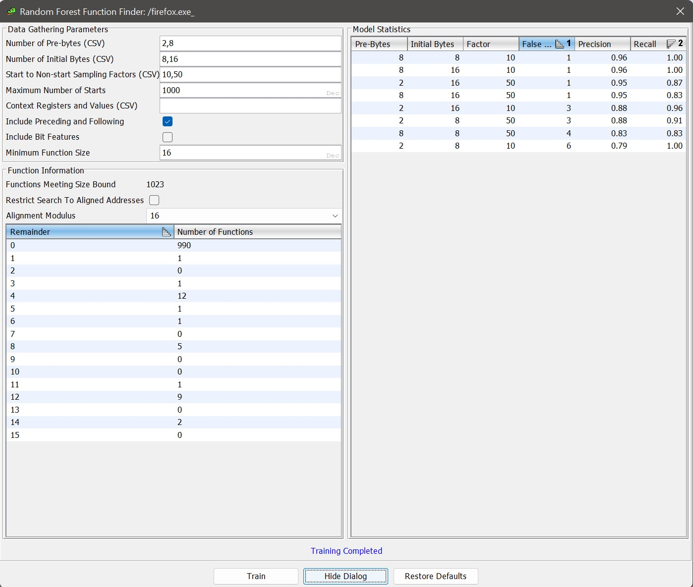

In the "What's New" document for [Ghidra version 10.2](https://htmlpreview.github.io/?https://github.com/NationalSecurityAgency/ghidra/blob/Ghidra_10.2_build/Ghidra/Configurations/Public_Release/src/global/docs/WhatsNew.html) there's a fascinating description of a new feature:

> Machine Learning
>
> An optional MachineLearning extension has been added containing the Random Forest Function Finder Plugin. The plugin finds undiscovered functions within a binary using classifiers to identify potential function starts. The plugin trains classifiers using data sets created from known functions within a binary. These classifiers can then be used by the plugin on the original binary or other binaries to find additional functions missed by initial analysis.
> 
> The extension can be installed from the Ghidra Project Window via File->Install Extensions... 

And, from the [Change history](https://htmlpreview.github.io/?https://github.com/NationalSecurityAgency/ghidra/blob/Ghidra_10.2_build/Ghidra/Configurations/Public_Release/src/global/docs/ChangeHistory.html):

> Extensions. A MachineLearning extension has been added. This contains a plugin for finding code and functions in a binary by training on functions which have already been found. (GP-2204)

Deciding to classify an address as code and/or data is a challenging problem in reverse engineering. Many tools, Ghidra included, ship hardcoded signatures used to help find code and function start addresses. For example, Ghidra has the file [x86win_patterns.xml](https://github.com/NationalSecurityAgency/ghidra/blob/49c2010b63b56c8f20845f3970fedd95d003b1e9/Ghidra/Processors/x86/data/patterns/x86win_patterns.xml) that describes common function prologues on Intel x86:

```xml
<patternlist>
  <patternpairs totalbits="32" postbits="16"> <!-- Main patterns -->
    <prepatterns>
      <data>0xcc</data> <!-- CC debug filler -->
      <data>0xcccc</data> <!-- multiple CC filler bytes -->
      <data>0x90</data> <!-- NOP filler -->
      <data>0xc3</data> <!-- RET filler -->
      <data>0xc9c3</data> <!-- LEAVE RET -->
      <data>0xc2 ......00 0x00</data>  <!-- RET longform -->
    </prepatterns>
    <postpatterns>
      <data>0x558bec</data>  <!-- PUSH EBP : MOV EBP,ESP -->
      <data>0x83ec 0.....00 </data> <!-- SUBESP#small -->
```

This is probably generated by the [
Function Bit Patterns Explorer Plugin](https://github.com/NationalSecurityAgency/ghidra/tree/b4de95f4f5c5b2d22e2861a08f7f8f6b40f6e6a7/Ghidra/Features/BytePatterns/src/main/java/ghidra/bitpatterns):

> The Function Bit Patterns Explorer Plugin is used to discover patterns in the bytes around function starts and returns. When analyzing a single program, such patterns can be used to discover new functions based on the functions that have already been found.


Anyways, the "machine learning" extension appears to be a new solution to this problem: generate a random forest classifier using sequences of code from the current module to decide if each address might be the start of a function. If the initial auto-analysis is able to reliably recover some code, such via recursive descent from the entry point and exports, then the byte patterns can be generalized from these examples.

Of course, this assumes that the undiscovered code looks similar to the discovered code. And, there's the assumption that module doesn't contain data that looks like valid function start code. I wonder if we can find a way to quantify and validate the performance of this technique?

Other questions:
  - how well does a model trained on one binary work against another? Seems highly dependent upon compiler settings. But what about a collection of training binaries?
  - the negative class examples are all code that aren't function starts, not data. Does this introduce bias in the classifier?
  - what's the performance of scanning like? It scans for each byte, so this could be slow? But it could also be parallelized.
  - how does the accuracy compare with the Bit Patterns mechanism? Is it more usable or automated? Why would you use one versus the other?

First, some background research:

"GP-2204" seems to be the internal issue tracker topic for the feature. It doesn't correspond to [ghidra#2204](https://github.com/NationalSecurityAgency/ghidra/issues/2204), which is about accessing the syntax tree of the decompilation window.
Commit [956a276](https://github.com/NationalSecurityAgency/ghidra/commit/956a276387cb2068ce4ca12595c6b699d457792b) by [@ghidracadabra](https://github.com/ghidracadabra) adds the feature: 52 changed files with 6,696 additions and 0 deletions. 

The extension uses the [Tribuo machine learning library for Java](https://tribuo.org/). This is what provides the random forest training and evaluation implementations.

Extension metadata from [`extension.properties`](https://github.com/NationalSecurityAgency/ghidra/commit/956a276387cb2068ce4ca12595c6b699d457792b#diff-72fa3b5fed1156f43819409b482550cc8937a927e4498a0cfd99ae9460492230):

```ini
name=MachineLearning
description=Finds functions using ML
author=Ghidra Team
createdOn=9/25/2022
version=@extversion@
```

Here's the built-in usage documentation via [RandomForestFunctionFinderPlugin.htm](https://github.com/NationalSecurityAgency/ghidra/commit/956a276387cb2068ce4ca12595c6b699d457792b#diff-cd2bbc9de62498ca20bea329b0a51981d6b07548b808f5daba611a724ec5d421). Take a moment to read all of it, since it touches on a number of configuration knobs that suggest how the classifier is intended to work.

<details>
  <summary>Random Forest Function Finder Plugin</summary>
  <div style="margin-left: 1em; padding-left: 1em; border-left: 3px solid grey;">
  <H1><A name="RandomForestFunctionFinderPlugin"></A>Random Forest Function Finder Plugin</H1>

  <P> This plugin trains models used to find function starts within a program.  Essentially,
  the training set consists of addresses in a program where Ghidra's analysis was able to 
  find functions.  The models are then applied to the rest of the program.  
  Models can also be applied to other programs. </P>

  <P> In the motivating use case, you either don't know the toolchain which produced a program
  or do not have a large number of sample programs to train other types of models. </P> 

  <P> Note: in general, this plugin ensures that addresses used for training, testing, or
  searching for function starts are aligned relative to the processor's instruction alignment.
  Defined data within an executable block is an exception - all such bytes are added to
  the test set as examples of non-starts.</P>

  <H2><A name="SuggestedWorkflow"></A> Basic Suggested Workflow</H2>
  <ol>
      <li> To begin, select <em>Search-&gt;For Code And Functions...</em> from the Code Browser.</li>
      <li> Click the <em>Train</em> button to train models using the default parameters.</li>
      <li> Choose the model with the fewest false positives (which will be apparent from
            the <em>Model Statistics</em> table).</li>  
      <li> Right-click on that model's row and select <em>DEBUG - Show test set errors</em>.</li>
      <li> Examine the resulting table to determine if there is a good cutoff for
            the probabilities.  Note that some of the "errors" might not actually be
            errors of the model: see the discussion in 
            <A href="#DebugModelTable">Debug Model Table</A>.</li>
      <li> If you're satisified with the performance of the model, right-click on the
            row and select <em>Apply Model</em>.  If you aren't, you can try changing the parameters
            and training again.  You can also try the <em>Include Bit Features</em> training option.</li>
      <li> In the resulting table, select all addresses with an <em>Undefined</em> interpretation whose
            probability is above your threshold, right-click, and select <em>Disassemble</em>.  This will 
            start disassembly (and follow-on analysis) at each selected address.</li>
      <li> Now, select all addresses whose interpretation is <em>Block Start</em> and whose probability
            of being a function is above your threshold, right-click, and select <em>Create Function(s)</em>.
            It's also probably worth filtering out any addresses which are the targets of 
            conditional references (which can be seen in the <em>Conditional Flow Refs</em> column). </li>
  </ol>
  <P> The script <em>FindFunctionsRFExampleScript.java</em> shows how to access the functionality of
  this plugin programmatically. </P>

  <H2><A name="ModelTrainingTable"></A> Model Training Table</H2>
  <P> This table is the main interface for training and applying models. </P>

  <H3><A name="DataGatheringParameters"></A> Data Gathering Parameters</H3>
  <P> The values in this panel control the number of models trained and the data used to train them.
  The first three fields: <A href="#NumberOfPreBytes">Number of Pre-Bytes (CSV)</A>,
  <A href="#NumberOfInitialBytes">Number of Initial Bytes (CSV)</A>, and 
  <A href="#StartToNonStartFactors"> Start to Non-start Sampling Factors (CSV)</A> accept
  CSVs of positive integers as input (a single integer with no comma is allowed).  Models
  corresponding to all possible choices of the three values will be trained and evaluated.
  That is, if you enter two values for the <em>Pre-bytes</em> field, three values for the
  <em>Initial Bytes</em> field, and four values for the <em>Sampling Factors</em> field, a total
  of 2*3*4 = 24 models will be trained and evaluated. </P>

  <H4><A name="NumberOfPreBytes"></A> Number of Pre-bytes (CSV) </H4>
  <P> Values in this list control how many bytes before an address are used to construct its
  feature vector. </P>

  <H4><A name="NumberOfInitialBytes"></A> Number of Initial Bytes (CSV) </H4>
  <P> Values in this list control how many bytes are used to construct the feature vector
  of an address, starting at the address. </P>

  <H4><A name="StartToNonStartFactors"></A> Start to Non-start Sampling Factors (CSV) </H4>
  <P> Values in this list control how many non-starts (i.e., addresses in the interiors
  of functions) are added to the training set for each function start in the training set.</P>

  <H4><A name="MaximumNumberOfStarts"></A> Maximum Number Of Starts </H4>
  <P> This field controls the maximum number of function starts that are added to the training
  set. </P>

  <H4><A name="ContextRegsAndValues"></A> Context Registers and Values (CSV) </H4>
  <P> This field allows you to specify values of context registers.  Addresses will only
  be added to the training/test sets if they agree with these values, and the disassembly
  action on the <a href="#FunctionStartTable"> Potential Functions Table</a> will apply the
  context register values first.  This field accepts CSVs of the form "creg1=x,creg2=y,...".
  For example, to restrict Thumb mode in an ARM program, you would enter "TMode=1" in this field.
  </P>

  <H4><A name="IncludePrecedingAndFollowing"></A> Include Preceding and Following </H4>
  <P> If this is selected, for every function entry in the training set, the code units immediately
  before it and after it are added to the training set as negative examples (and similarly for the
  test set). </P> 

  <H4><A name="IncludeBitFeatures"></A> Include Bit Features </H4>
  <P> If this is selected, a binary feature is added to the feature vector for each bit in the 
  recorded bytes. </P>

  <H4><A name="MinimumFunctionSize"></A> Minimum Function Size </H4>
  <P> This value is the minimum size a function must be for its entry and interior to be included
  in the training and test sets. </P>

  <H3><A name="FunctionInformation"></A> Function Information</H3>
  <P> This panel displays information about the functions in the program. </P>

  <H4><A name="FunctionsMeetingSizeBound"></A> Functions Meeting Size Bound</H4>
  <P> This field displays the number of functions meeting the size bound in the
  <A href="#MinimumFunctionSize"> Minimum Function Size</A> field.  You can use
  this to ensure that the value in <A href="#MaximumNumberOfStarts">Maximum Number
  of Starts</A> field doesn't cause all starts to be used for training (leaving
  none for testing).</P>

  <H4><A name="RestrictSearchToAlignedAddresses"></A> Restrict Search to Aligned Addresses </H4>
  <P> If this is checked, only addresses which are zero modulo the value in the 
  <A href="#AlignmentModulus">Alignment Modulus</A> combo box are searched for function starts.
  This does not affect training or testing, but can be a useful optimization when applying
  models, for instance when the <A href="#FunctionAlignmentTable">Function Alignment Table</A>
  shows that all (known) functions in the program are aligned on 16-byte boundaries. </P>

  <H4><A name="AlignmentModulus"></A> Alignment Modulus </H4>
  <P> The value in this combo box determines the modulus used when computing the values in
  the <A href="#FunctionAlignmentTable">Function Alignment Table</A>. </P>

  <H4><A name="FunctionAlignmentTable"></A> Function Alignment Table </H4>
  <P> The rows in this table display the number of (known) functions in the program
  whose address has the given remainder modulo the alignment modulus.</P>

  <H3><A name="ModelStatistics"></A> Model Statistics</H3>
  <P> This panel displays the statistics about the trained models as rows in a table.
  Actions on these rows allow you to apply the models or see the test set failures.</P>

  <H4><A name="ApplyModel"></A> Apply Model Action </H4>
  <P> This action will apply the model to the program used to train it. The addresses
  searched consist of all addresses which are loaded, initialized, marked as executable,
  and not already in a function body (this set can be modified by the user via the
  <A href="#RestrictSearchToAlignedAddresses"> Restrict Search to Aligned Addresses</A>
  and <A href="#MinLengthUndefinedRange"> Minimum Length of Undefined Ranges to Search</A> 
  options).  The results are displayed in a 
  <A href="#FunctionStartTable"> Function Start Table</A>. </P>

  <H4><A name="ApplyModelTo"></A> Apply Model To... Action </H4>
  <P> This action will open a dialog to select another program in the current project and
  then apply the model to it.  Note that the only check that the model is compatible with
  the selected program is that any context registers specified when training must be
  present in the selected program. </P> 

  <H4><A name="DebugModel"></A> Debug Model Action </H4>
  <P> This action will display a <A href="#DebugModelTable"> Debug Model Table</A>, which shows 
  all of the errors encountered when applying the model to its test set. </P>

  <H2><A name="FunctionStartTable"></A> Potential Functions Table</H2>
  <P> This table displays all addresses in the search set which the model thinks are function starts
  with probability at least .5. The table also shows the current "Interpretation" (e.g., undefined,
  instruction at start of basic block, etc) of the address along with the numbers of certain types
  of references to the address. </P>
  <P> The following actions are defined on this table:</P>

  <H3><A name="DisassembleAction"></A> Disassemble Action </H3>
  <P> This action is enabled when at least one of the selected rows corresponds to an address
  with an interpretation of "Undefined".  It begins disassembly at each "Undefined" address
  corresponding to a row in the selection. </P>

  <H3><A name="DisassembleAndApplyContextAction"></A> Disassemble and Apply Context Action </H3>
  <P> This action is similar to the <A href="#DisassembleAction">Disassemble Action</A>, except
  it sets the context register values specified before training the model at the addresses
  and then disassembles. </P>   

  <H3><A name="CreateFunctionsAction"></A> Create Functions Action </H3>
  <P> This action is enabled whenever the selection contains at least one row whose corresponding
  address is the start of a basic block.  This action creates functions at all such addresses.</P>

  <H3><A name="ShowSimilarStartsAction"></A> Show Similar Function Starts Action </H3>
  <P> This action is enabled when the selection contains exactly one row.  It displays
  a <A href="#SimilarStartsTable"> table</A> of the function starts in the training set
  which are most similar to the bytes at the address of the row. </P>

  <H2><A name="SimilarStartsTable"></A> Similar Function Starts Table </H2>
  <P> This table displays the function starts in the training set which are most similar
  to a potential function start "from the model's point of view".  Formally, similarity
  is measured using <b>random forest proximity</b>.  Given a potential start <i>p</i> and
  a known start <i>s</i>, the similarity of <i>p</i> and <i>s</i> is the proportion of trees
  which end up in the same leaf node when processing <i>p</i> and <i>s</i>. </P>
  <P> For convenience, the potential start is also displayed as a row in the table.  In
  the Address column, its address is surrounded by asterisks.</P>

  <H2><A name="DebugModelTable"></A> Debug Model Table </H2>
  <P> This table has the same format as the <A href="#FunctionStartTable">Potential Functions Table</A>
  but does not have the disassembly or function-creating actions (it does have the action to
  display similar function starts).  It displays all addresses in the test set where the classifier
  made an error.  Note that some in some cases, it might be the classifier which is correct and the
    original analysis which was wrong.  A common example is a tail call which 
  was optimized to a jump during compilation.  If there is only one jump to this address, then analysis
  may (reasonably) think that the function is just part of the function containing the jump even though
  the classifier thinks the jump target is a function start.</P>

  <H2><A name="Options"></A> Options </H2>
  <P> This plugin has the following options. They can be set in the Tool Options menu. </P>

  <H3><A name="MaxTestSetSize"></A> Maximum Test Set Size </H3>
  <P> This option controls the maximum size of the test sets (the test set of function
  starts and the test set of known non-starts which together form the model's "test set").  
  Each set that is larger than the maximum will be replaced with a random subset of the maximum size. </P> 

  <H3><A name="MinLengthUndefinedRange"></A> Minimum Length of Undefined Ranges to Search </H3>
  <P> This option controls the minimum length a run of undefined bytes must be in order to
  be searched for function starts.  This is an optimization which allows you to skip the
  (often quite numerous) small runs of undefined bytes between adjacent functions.  Note
  that this option has no effect on model training or evaluation.  </P>

  <P class="providedbyplugin">Provided By: <I>RandomForestFunctionFinderPlugin</I></P>    
  </div>
</details>

---

### Thoughts and notes

Setting it up:

  1. Toolchest -> File -> Install Extensions -> MachineLearning
  2. restart ghidra



Increasing "Start to Non-start Sampling Factors" increases training time (there's more data to process). For a factor of 2, we can imagine that for each function, two random addreses are chosen from the interior of that function to represent a non-start. 

Blind spot: data thats not code, such as switch tables or string resources. These won't be seen in the training data, neither as a function start nor non-start. So how does the model classify this?

Results: It found five more functions. The UI makes it very easy to review and apply the recommendations.

Potential issue (I am not a ML engineer!): The extension treats all the features, such as "initial byte" values, as numeric. While byte values *are* physically numeric, when they encode things like instruction opcodes, I don't think they shouldn't necessarily be interpreted as such. For example, drastically different x86 instructions may have similar encodings. I think this may be a problem for the ML extension because a Random Forest classifier does try to exploit characteristics of numeric features, like when it tries to find the best value to branch a tree. I understand that a typical fix for this, to convert a numeric feature to a categorical featue, would be to use one-hot encoding. Then again, the extension does seem to work as-is, so my intuition may be wrong.