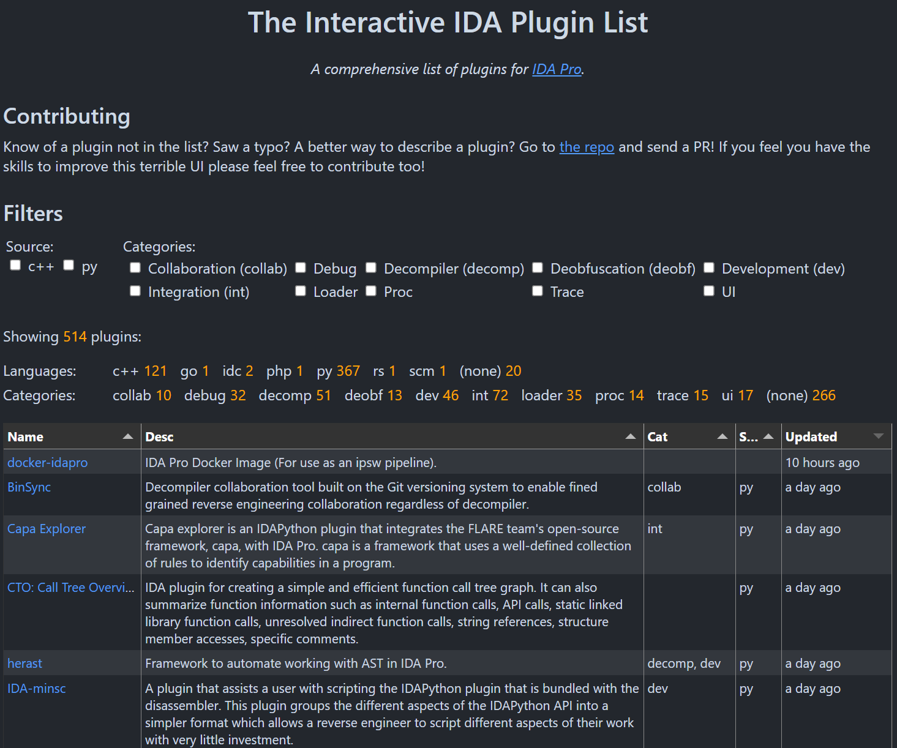
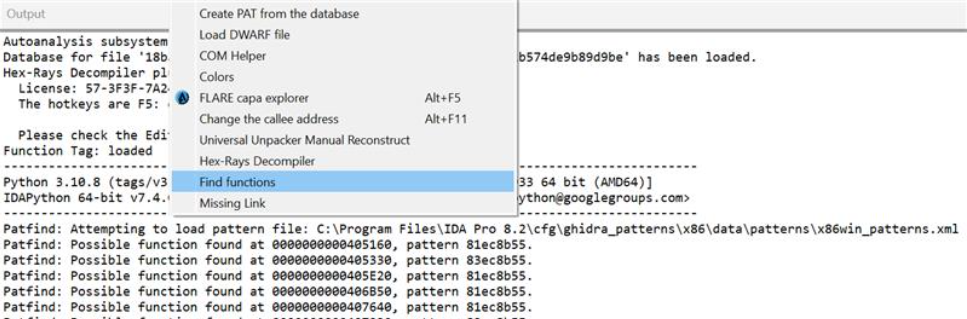

I've been periodically reloading the [vmallet Interactive IDA Plugin List](https://vmallet.github.io/ida-plugins/) and sorting by "updated" to find new and/or actively developed IDA plugins.

[Missing Link](https://github.com/kweatherman/ida_missinglink) is a plugin by Kevin Weatherman that uses WinDbgX Time Travel Debugger (TTD) traces to resolve indirect branches. Notably, it has a lot of coverage for the undocumented TTD API, which is pretty exciting. I've also enjoyed playing with the Airbus CERT [ttddbg plugin](https://github.com/airbus-cert/ttddbg) to explore TTD trace files from the IDA debugger interface. I've used the Python bindings in [ttd-bindings](https://github.com/commial/ttd-bindings) briefly, but need keep exploring. An obvious goal is to approximate [FLOSS](https://github.com/mandiant/flare-floss) by periodically scanning trace memory for human readable strings, perhaps at every API call.

I also stumbled across the new plugin bundled with IDA Pro 8.0: [patfind](https://hex-rays.com/blog/the-ida-patfind-plugin/). This plugin uses the [function byte pattern database from Ghidra](https://github.com/NationalSecurityAgency/ghidra/tree/master/Ghidra/Processors/x86/data/patterns) to find function prologues in arbitrary binary data. They say that this pattern matcher is more reliable than the old IDA mechanism, though its only automatically invoked when inspecting raw binary files (not recognized executable modules). You can invoke it manually via Edit > Plugins > "Find functions".

I'm amused, but maybe also happy, that Hex-Rays used the format and data invented by Ghidra. Agreeing on a common format makes it easier to enhance the database used by both tools. Ghidra already has tooling to create these patterns via the [Function Bit Patterns Explorer plugin](https://github.com/NationalSecurityAgency/ghidra/blob/59371bfb36e09bb8deaf71cff39ae05e8c2b9ff2/Ghidra/Features/BytePatterns/src/main/help/help/topics/FunctionBitPatternsExplorerPlugin/FunctionBitPatternsExplorerPlugin.htm#L12).

The plugin distributed by Hex-Rays is derived from [IDAPatternSearch](https://github.com/david-lazar/IDAPatternSearch) by David Lazar at [Argus](https://argus-sec.com/blog/engineering-blog/using-bitfield-patterns-to-identify-functions-in-binaries/).