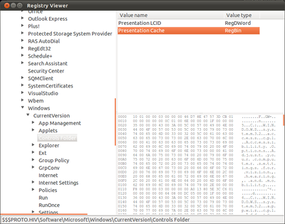

Introduction 
------------

python-registry was originally written by [Willi Ballenthin](), a forensic analyst who wanted
to access the contents of the Windows Registry from his Linux laptop.
python-registry currently provides read-only access to Windows Registry
files, such as `NTUSER.DAT`, `userdiff`, and `SOFTWARE`. The interface is
two-fold: a high-level interface suitable for most tasks, and a low
level set of parsing objects and methods which may be used for advanced
study of the Windows Registry. python-registry is written in pure
Python, making it portable across all major platforms.

Download 
--------

python-registry can be downloaded at GitHub [here](https://github.com/williballenthin/python-registry).

Usage 
-----

Most users will find the `Registry.Registry` module most appropriate.
The module exposes three classes: the `Registry`, the `RegistryKey`, and
the `RegistryValue`. The `Registry` organizes parsing and access to the
Windows Registry file. The `RegistryKey` is a convenient interface into
the tree-like structure of the Windows Registry. A `RegistryKey` may
have children `RegistryKeys`, and may also have values associated with
it. A `RegistryValue` can be thought of as the tuple (name, datatype,
value) associated with a `RegistryKey`. python-registry supports all
major datatypes, such as `RegSZ`, `RegDWord`, and `RegBin`.

### Open a Windows Registry file

Its this easy:


import sys
from Registry import Registry

reg = Registry.Registry(sys.argv[1])


### Print all keys in a Registry


def rec(key, depth=0):
    print "\t" * depth + key.path()
    
    for subkey in key.subkeys():
        rec(subkey, depth + 1)

rec(reg.root())


### Find a key and print all string values


try:
    key = reg.open("SOFTWARE\\Microsoft\\Windows\\Current Version\\Run")
except Registry.RegistryKeyNotFoundException:
    print "Couldn't find Run key. Exiting..."
    sys.exit(-1)

for value in [v for v key.values() \
                   if v.value_type() == Registry.RegSZ or \
                      v.value_type() == Registry.RegExpandSZ]:
    print "%s: %s" % (value.name(), value.value())


Advanced users who wish to study the structure of the Windows Registry
may find the `Registry.RegistryParse` module useful. This module
implements all known structures of the Windows Registry.

Testing 
-------

python-registry was developed using Python 2.6.5 on Ubuntu Linux. More
importantly, the package was tested against a small set of Windows XP
SP3 Registry files acquired from one of the author's virtual machines.
The script `testing/RegTester.py` will parse the .reg files exported by
Microsoft Regedit and compare the values parsed by python-registry. This
tool can be used to identify regressions and deficiencies in the
development of python-registry.

Sources 
-------

Nearly all structure definitions used in python-registry came from one
of two sources:

1.  [WinReg.txt](http://pogostick.net/~pnh/ntpasswd/WinReg.txt), by B.H.
2.  [The Windows NT Registry File Format](http://sentinelchicken.com/data/TheWindowsNTRegistryFileFormat.pdf) version 0.4, by Timothy D. Morgan

Copies of these resources are included in the `documentation/` directory
of the python-registry source.

Samples 
------

The source directory for python-registry contains a `samples/` subdirectory
that contains small programs that use python-registry. For example,
`regview.py` is a read-only clone of Microsoft Window's Regedit,
implemented in a few hundred lines. 

 

License 
-------

python-registry is released under the [Apache v2.0 license](http://www.apache.org/licenses/LICENSE-2.0.html).
